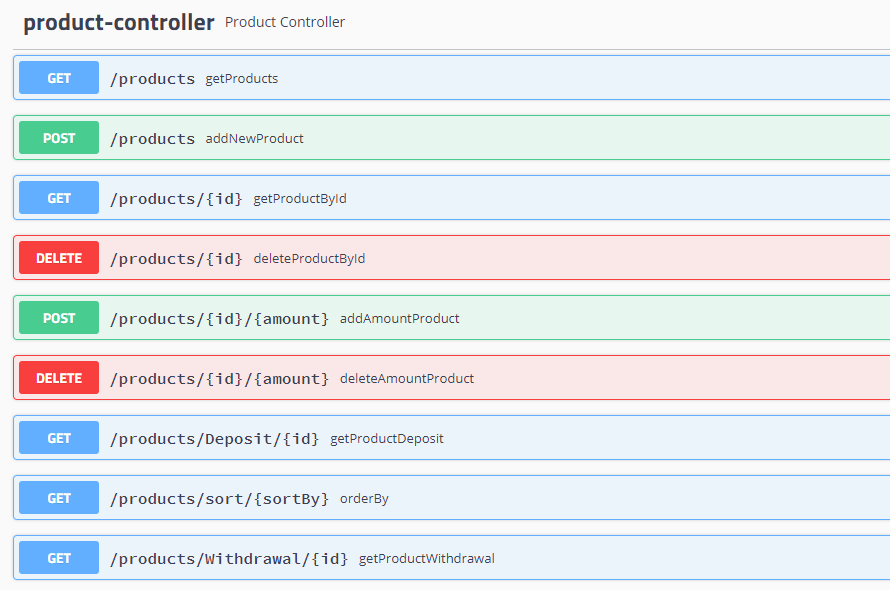

# inventory-management-app
inventory management application

**A spring-boot application with a REST controller, which expose a Swagger API catalog.** 
Data should be persisted on H2 DB using JPA.

The application has the following APIs:

* List of the inventory items list (item no, name, amount, inventory code)
* Read item details (by item no)
* Withdrawal quantity of a specific item from stock
* Deposit quantity of a specific item to stock
* Add item to stock
* Delete an item from stock

<kbd></kbd>
